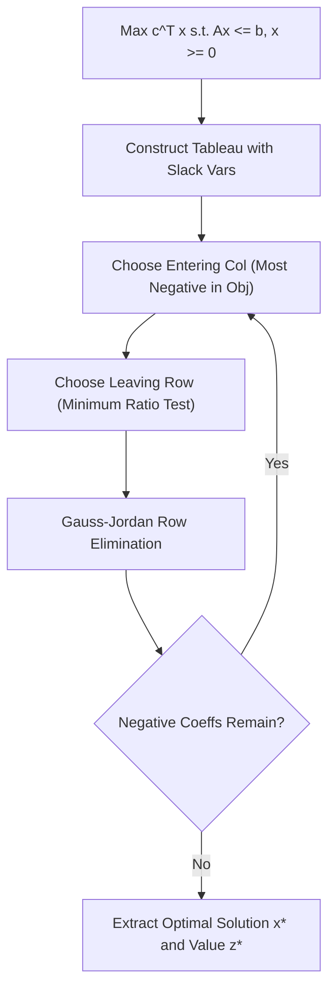

# Simplex Linear Programming Skill

Canonical Simplex tableau solver for constrained linear optimization problems.

## Features
- **100% Python Standard Library**: Pure matrix row reduction.
- **Unbounded & Feasibility Detection**: Built-in edge condition checks.
- **MCP Server Ready**: Instant stdio access for operational research.
